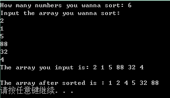

## Algorithm learning
### Class 1--insertion sorting
    今天开始重新学习算法知识，推荐一个非常好的算法学习课程，MIT-6.046J。(课程网页)[http://v.163.com/special/opencourse/algorithms.html]

    第一节课讲述了数组插入排序的方法，插值算法依笔者看来，即为从第二个元素，即Array[1]开始，将其值key与之前的元素进行对比，例如Array[9]即仅需与Array[0]到Array[8]进行比较，若后数小于前数，则交换两者位置。

    笔者在此处通过C语言将其实现，并在数组创建上采用了动态数组，使得该程序在对不同元素数量的数组进行排序时无需修改源代码。

代码如下：

```
// Algo_learning--sorting--insertion_sorting
// Programmed by Sn0wrain    2015-6-14
// Upadte1:Use the malloc to create a dynamic array to generate the array of any numbers

#include <stdio.h>
#include <malloc.h>
int main()
{
    int i,key,m,size;
    // Dynamic arrays should firstly be defined
    int *a;

    // Then assign [malloc(n1 * sizeof(int) = calloc(n1, sizeof(int)))]
    printf("How many numbers you wanna sort: ");    
    scanf("%d",&size);
    a=(int*)malloc(size * sizeof(int));             
    printf("Input the array you wanna sort:\n");    
    
    //Input the array
    for(i=0;i<size;i++)
        {
            scanf("%d",&a[i]);
        }
    printf("The array you input is:");
    for(i=0;i<size;i++)
        {
            printf(" %d",a[i]);    
        }
    printf("\n");
    for(i=1;i<size;i++)
        {
            key=a[i];
            for(m=i-1;m>-1;m--)
            {
                if(key<a[m])
                {
                    //Swap the key
                    a[m+1]=a[m];        
                    a[m]=key;        

                }
            }
            
        }
    printf("\nThe array after sorted is :");
    for(i=0;i<size;i++)
        {
            printf(" %d",a[i]);
        }
    printf("\n");
    free(a);    
    return 0;
}
```

    运行结果如图所示
    
